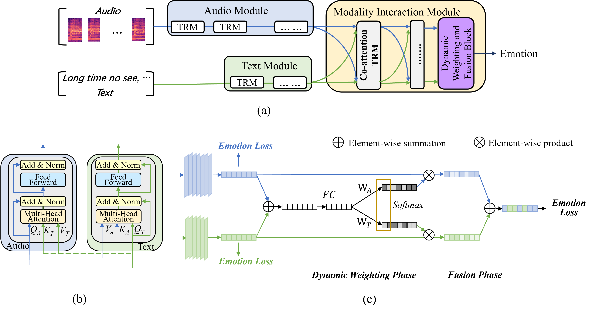
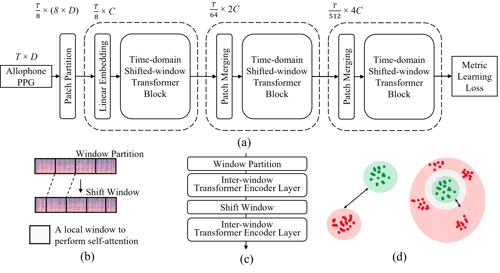
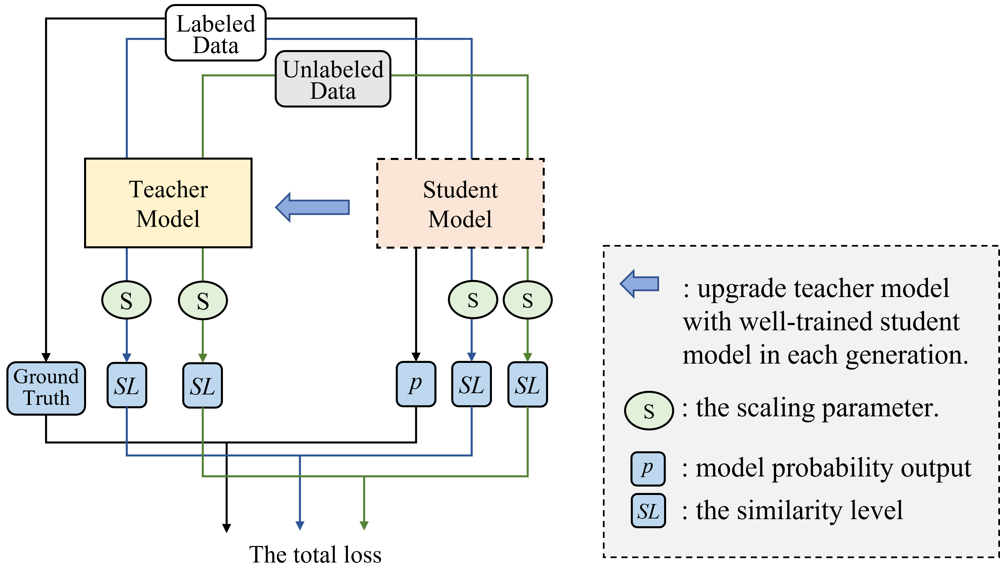

Click [here](../files/CV.pdf) to download the PDF version. (Updated on 2024/01/24)


Education
======

### Hong Kong University of Science and Technology

    <i>Doctor of Philosophy</i>
    
        <i>2023/09 – Present</i>
    

<!-- _Doctor of Philosophy, 2023/09 – Present_       -->
* GPA: 3.7/4.3

### Fudan University

    <i>Master of Engineering in Computer Technology</i>
    
        <i>2019/09 – 2022/01</i>
    

<!-- _Master of Engineering in Computer Technology, 2019/09 – 2022/01_ -->
* Research Interests: Multimodal/Speech/Music Emotion Recognition, Singing Voice Detection
* GPA: 3.01/4.0

### Dalian University of Technology

    <i>Bachelor of Engineering in Computer Science and Technology</i>
    
        <i>2014/09 – 2018/07</i>
    

<!-- _Bachelor of Engineering in Computer Science and Technology, 2014/09 – 2018/07_ -->
* Honors: <u>National Encouragement Scholarship (2015) </u>, Learning Excellent Award (2015)
<!-- * Honors: National Encouragement Scholarship (2015), Learning Excellent Award (2015) -->
* GAP: 3.27/5, Ranking: 20/102

Work Experience
======

### Baidu Inc.

    <i>Speech & Audio Research Engineer</i>
    
        <i>2022/02 – 2022/07</i>
    

<!-- _Speech Algorithm Engineer, 2022.02 – 2022.07_ -->
* Customized Keyword Spotting algorithm development.
* Auto Keyword Spotting algorithm research and development.

### Tencent Music Entertainment

    <i>Music & Audio Research Intern</i>
    
        <i>2021/06 – 2021/09</i>
    

<!-- _Audio and Music Algorithm Intern, 2021/06 – 2021/09_ -->
* Singing Evaluation algorithm development (vocal range, pitch accuracy, vocal stability, and sense of rhythm).
* Accented Singing Identification algorithm research and development.

Research Experience
======

### Rule-Based Network for Multimodal Emotion Recognition

    <i>Based on the relationship between audio and text, two rules of designing Multimodal Emotion Recognition model are proposed, and corresponding rule-based multimodal attention network (MMRBAN) is designed.</i>
    
        <i>2022/08 – 2023/01</i>
    

<table style="width:100%">
  <tr>
    <th width="40%">
      
    </th>
    <th style="text-align:left" width="60%">
      <ul>
      <li>As for the relationship between audio and text, since text modality is not independent of the audio modality, the former is embedded in the latter naturally, we propose <i>Rule 1</i>: The audio module should be more expressive than the text module. In MMRBAN, we adopt <i>M</i> Transformer encoder layers for the audio module, and <i>N</i> for the textual module, with restricting <i>M > N</i>.</li>
      <li>As for how the audio and the text contribute to emotion expression, since the emotion expressed in each modality can be homogeneous or heterogeneous to the overall emotion the speaker expressed, we propose <i>Rule 2</i>: Each single-modality emotion representation should be dynamically fused into the multimodal emotion representation. In MMRBAN, we design a Dynamic Weighting and Fusion Block, which is part of the modality interaction module.</li>
      </ul>
    </th>
  </tr> 
</table>

### Metric Learning with Time-domain Shifted-window Transformer for Accented Singing Identification

    <i>This work is the first dedicated in Accented Singing Identification, with three new challenges discussed and the corresponding Metric Learning with Time-domain Shifted-window Transformer (ML_TSWTF) proposed.</i>
    
        <i>2021/06 – 2021/09</i>
    

<table style="width:100%">
  <tr>
    <th width="40%">
      
    </th>
    <th style="text-align:left" width="60%">
      <ul>
      <li>As for audio representation, the posterior probability graph of allophone is used, because it reveals the phoneme and the phonetic realization simultaneously and is robust to pitch and rhythm which are irrelevant in the singing accent.</li>
      <li>As for backbone, since audio representation is of high resolution and music pieces are usually in a length of a few minutes, a Transformer with time-domain shifted-window is designed, which is computationally efficient in both time and space.</li>
      <li>As for learning objective, since various unformal articulation methods contribute to various latent clustering centers in the accented singing, the triplet loss in metric learning, rather than the cross-entropy loss, is used, which doesn’t minimize intra-class distance among negative samples.</li>
      </ul>
    </th>
  </tr> 
</table>

### Similarity-based Semi-Supervised Learning for Singing Voice Detection

    <i>Compared with previous methods, the Similarity-based Semi-supervised Learning Method for Singing Voice Detection (SSSL_SVD) can alleviate the data scarcity problem with no additional human labor, no requirement of prerequisite knowledge, and no missing critical polyphonic knowledge.</i>
    
        <i>2020/09 – 2021/06</i>
    

 

<table style="width:100%">
  <tr>
    <th width="40%">
      
    </th>
    <th style="text-align:left" width="60%">
      <ul>
      <li>To enrich the diversity of training data, the Self-training Semi-supervised Learning method is used, which has two benefits. One is that it is prerequisite-free, another is that it can mine information from real-world unlabeled data without missing critical knowledge, such as the singing articulation, the synchronized nature between singing and accompaniment. </li>
      <li>To explore timber-related information and further facilitate decision-making, a similarity-based measurement, which is of higher entropy, is proposed. </li>
      <li>The proposed has a 2.2% promotion on accuracy and achieves comparable results with SOTA algorithms. </li>
      </ul>
    </th>
  </tr> 
</table>

Publications
======

* **Xi Chen**. [Accepted] MMRBN: Rule-Based Network for Multimodal Emotion Recognition. IEEE International Conference on Acoustics, Speech and Signal Processing (ICASSP), 2024. 
<!-- * [Paper](../files/MMRBN.pdf)  -->

* **Xi Chen**, Yongwei Gao, and Wei Li. Singing Voice Detection via Similarity-based Semi-supervised Learning. ACM International Conference on Multimedia in Asia (ACM MM Asia), 2022. [Paper](https://dl.acm.org/doi/abs/10.1145/3551626.3564963)

* Shuai Yu, **Xi Chen**, and Wei Li. Hierarchical Graph-based Neural Network for Singing Melody Extraction. IEEE International Conference on Acoustics, Speech and Signal Processing (ICASSP), 2022. [Paper](https://ieeexplore.ieee.org/document/9747629)

* **Xi Chen**, Lei Wang, and Wei Li. Channel-Wise Attention Mechanism in Convolutional Neural Networks for Music Emotion Recognition. Conference on Sound and Music Technology (CSMT), 2020. [Paper](https://link.springer.com/chapter/10.1007/978-981-16-1649-5_4)

* **Xi Chen**. **[Position Paper, Under review]** Social-PTM: Pre-training Model for Social Media Language Understanding using Hierarchical Contextual Constructive Learning Framework. The 2024 Joint International Conference on Computational Linguistics, Language Resources and Evaluation (LREC-COLING), 2024. 
<!-- * [Paper](../files/Social_PTM.pdf) -->

* Shuai Yu, Yi Yu, **Xi Chen**, and Wei Li. HANME: hierarchical attention network for singing melody extraction. IEEE Signal Processing Letters, vol. 28, pp. 1006-1010, 2021. [Paper](https://ieeexplore.ieee.org/document/9432745) 

Skills
======
* Languages: English (TOEFL: 97), Chinese (Native).
* Programming Languages: Python, Shell, C++, MATLAB.

<!-- 

Research Experience
======

### Rule-Based Network for Multimodal Emotion Recognition

    <i>Based on the relationship between audio and text, two rules of designing Multimodal Emotion Recognition model and corresponding rule-based multimodal attention network (MMRBAN) are proposed.</i>
    
        <i>2022.11 – 2023.05</i>
    

* As for the relationship between audio and text, since text modality is not independent of the audio modality, the former is embedded in the latter naturally, we propose _Rule 1_: The audio module should be more expressive than the text module. In MMRBAN, we adopt M Transformer encoder layers for the audio module, and N for the textual module, with restricting _M > N_.
* As for how the audio and the text contribute to emotion expression, since the emotion expressed in each modality can be homogeneous or heterogeneous to the overall emotion the speaker expressed, we propose _Rule 2_: Each single-modality emotion representation should be dynamically fused into the multimodal emotion representation. In MMRBAN, we design a Dynamic Weighting and Fusion Block, which is part of the modality interaction module.

### Metric Learning with Time-domain Shifted-window Transformer for Accented Singing Identification 

    <i>This work is the first dedicated in Accented Singing Identification, with three new challenges discussed and the corresponding Metric Learning with Time-domain Shifted-window Transformer (ML_TSWTF) proposed.</i>
    
        <i>2021.06 – 2021.09</i>
    

* As for audio representation, the posterior probability graph of allophone is used, because it reveals the phoneme and the phonetic realization simultaneously and is robust to pitch and rhythm which are irrelevant in the singing accent.
* As for backbone, since audio representation is of high resolution and music pieces are usually in a length of a few minutes, a Transformer with time-domain shifted-window is designed, which is computationally efficient in both time and space.
* As for learning objective, since various unformal articulation methods contribute to various latent clustering centers in the accented singing, the triplet loss in metric learning, rather than the cross-entropy loss, is used, which doesn’t minimize intra-class distance among negative samples.

### Similarity-based Semi-Supervised Learning for Singing Voice Detection

    <i>   </i>
    
        <i>2020.09 – 2021.06</i>
    

 
* We propose to enrich the diversity of training data using the Self-training Semi-supervised Learning method, because it is prerequisite-free and can mine information from real-world unlabeled data without missing information about singing articulation and the synchronized nature between singing and accompaniment.
* We propose to measure the audio frame from the similarity-based perspective, because it is of high entropy, can provide more timber-related information, and further facilitate decision-making.
* The proposed has a 2.2% promotion on accuracy and achieves comparable results with SOTA algorithms. 

 -->
<!-- <table style="width:100%; border-collapse: collapse; border: none;" >
  <tr>
    <th width="30%">
      
    </th>
    <th style="text-align:left" width="70%">
            <ul>
            <li>Coffee</li>
            <li>Milk</li>
            </ul>
    </th>
  </tr> 
</table> -->

<!-- 

    ### This text is left aligned
    
        This text is right aligned
    

| Option | Description |
| ------:| -----------:|
| data   | path to data files to supply the data that will be passed into templates. |
| engine | engine to be used for processing templates. Handlebars is the default. |
| ext    | extension to be used for dest files. | 
-->
